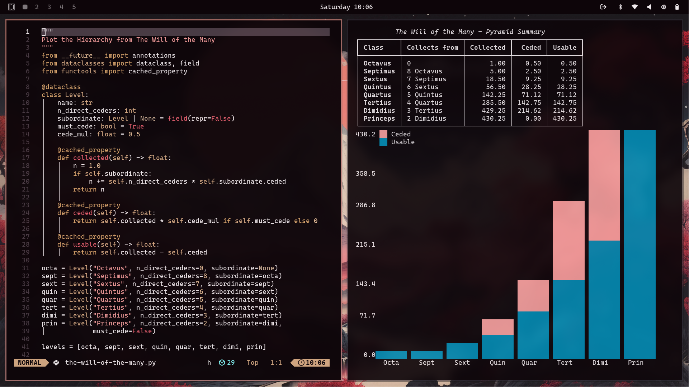

Just a bit of fun - I wrote some code to model the hierarchy pyramid from James Islington's book - The Will of the Many.



*usage*:
```sh
python the-will-of-the-many.py
```

use `-h` for help

example with theme specified:
```sh
python the-will-of-the-many.py --theme sakura
```
